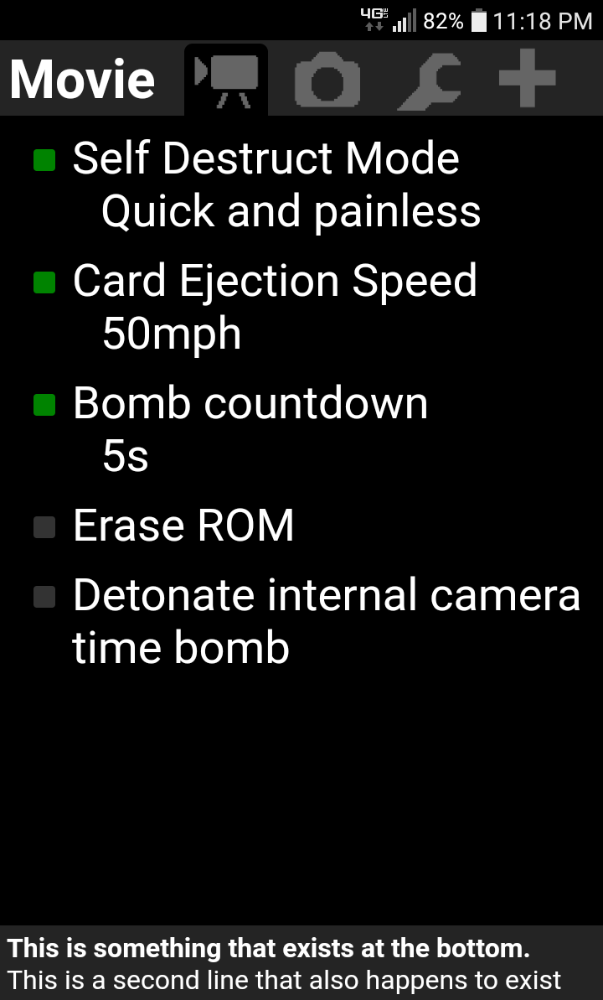

# The Magic Lantern Android App  
Unofficial and unfinished Magic Lantern Android App.  
Right now it only has basic PTP functionality and a stupid UI.



# What does it do?
https://github.com/petabyt/mlandroid/blob/master/src/main/java/ptp/PtpSession.java#L53  
Take pictures, get picture thumbnails, image reading stuff, and 0x9052 executeEventproc  

# Compiling
This uses the Debian AndroidTools rather than Android Studio.  
```
sudo apt install android-sdk android-sdk-platform-23
```
You will probably have to create a `local.properties` file:
```
sdk.dir=/usr/lib/android-sdk/
```
Right now, it doesn't use NDK (C/C++), but this may change.
